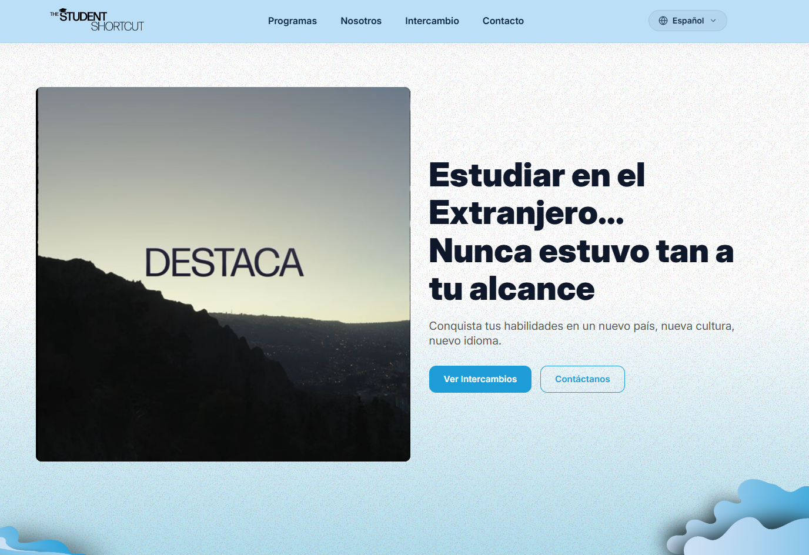
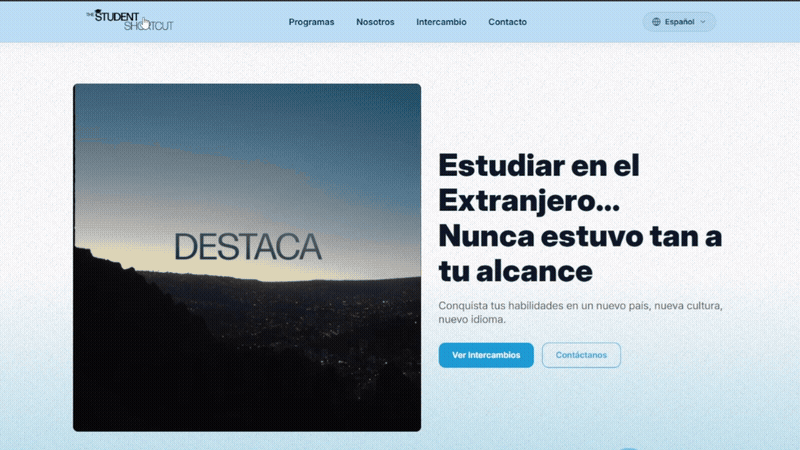

Student Shortcut

# Student Shortcut


> **Student Shortcut** es una landing page moderna y rápida diseñada para facilitar herramientas y accesos rápidos a estudiantes. Construida con Astro y optimizada para ser desplegada en Cloudflare Pages.

---

## 📸 Vista Previa / Demo

| Página Principal | Descripción |
| :------------------: | :-----------------------: |
|  | Página principal de la Página Studendt Shortcut |
| :------------------: | :-----------------------: |
| Video Demo | Descripción |
|  |  |


---

## 🛠️ Tecnologías Utilizadas

<p align="left">
  <a href="https://astro.build/" target="_blank" rel="noreferrer">
    
  </a>
  <a href="https://www.w3.org/html/" target="_blank" rel="noreferrer">
    
  </a>
  <a href="https://www.w3schools.com/css/" target="_blank" rel="noreferrer">
    
  </a>
  <a href="https://www.typescriptlang.org/" target="_blank" rel="noreferrer">
    
  </a>
  <a href="https://www.cloudflare.com/" target="_blank" rel="noreferrer">
    
  </a>
</p>

- **Core Framework:** [Astro](https://astro.build/) `v7.3`
- **Lenguajes:** HTML5, CSS3, [TypeScript](https://www.typescriptlang.org/)
- **Despliegue & Hosting:** [Cloudflare Pages](https://pages.cloudflare.com/)
- **Herramientas de CLI:** [Wrangler](https://developers.cloudflare.com/workers/wrangler/)

---

## ✨ Características Principales

- ⚡ **Rendimiento extremo:** Carga ultra rápida gracias a la arquitectura de Astro.
- 📱 **Diseño Responsive:** Adaptado para dispositivos móviles, tablets y escritorio.
- 🌐 **Despliegue Serverless:** Configurado para ejecutarse de forma eficiente en la red global de Cloudflare.

---

## 🚀 Comenzando

### Requisitos Previos

- **Node.js**: Debe ser la versión `>=22.12.0` o superior.

### Instalación

1. Clona el repositorio:
   ```bash
   git clone [https://github.com/tu-usuario/student-shortcut.git](https://github.com/tu-usuario/student-shortcut.git)
   cd student-shortcut
   ```